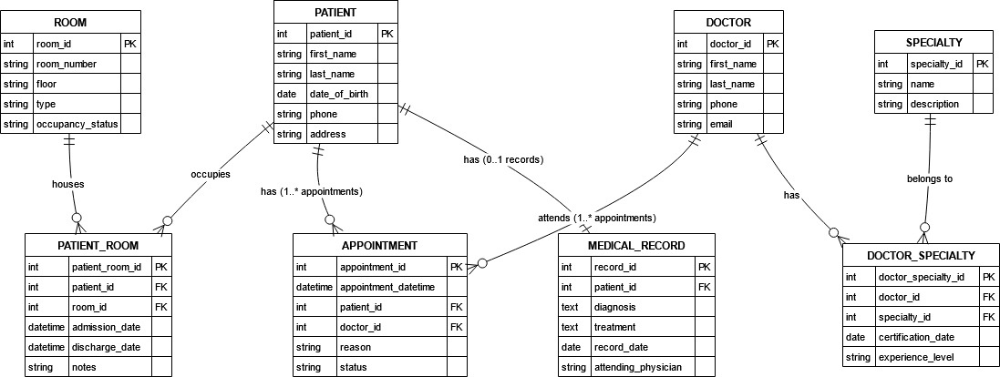
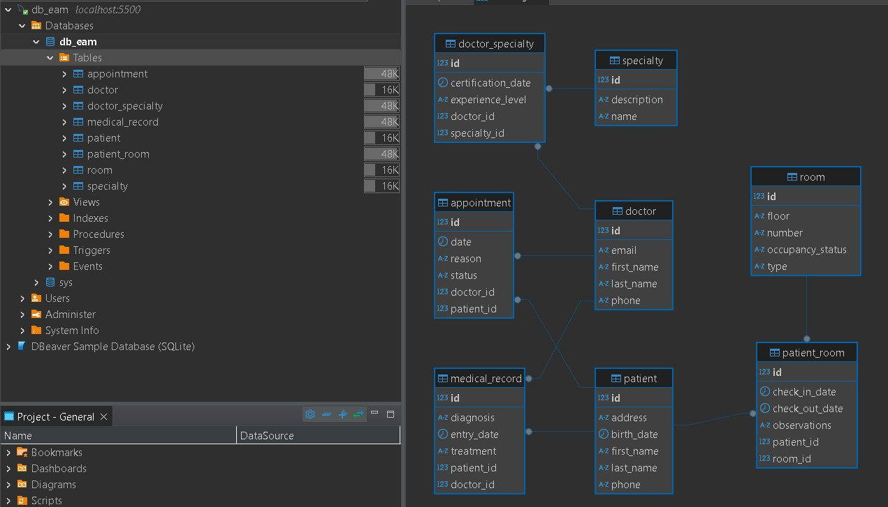
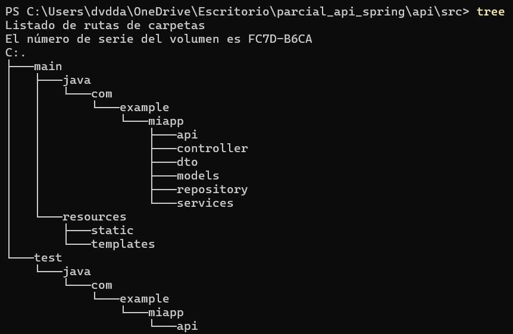

🏥 Hospital Management API 🏥
📌 Description

The Hospital Management API is a system developed with Spring Boot, designed to manage doctors, patients, specialties, rooms, and assignments within a hospital. It leverages Spring Data JPA for database interactions with MySQL, and Lombok to simplify code structure.
🚀 Technologies Used

    Spring Boot 3.4.3 🌱
    Spring Data JPA 🗄️
    Spring Web 🌐
    Spring Boot Starter Validation ✅
    MySQL 🛢️
    Lombok 🏗️
    Docker 🐳 (for containerized deployment)

📊 Relational Database Model

The Hospital Management API follows a well-structured relational database model designed to efficiently manage hospital operations. It ensures data integrity by using normalized relationships between key entities.
Entities and Relationships

1️⃣ Doctors (doctor)

    Can have multiple specialties (specialty) through the doctor_specialty table.
    Can be assigned to multiple appointments (appointment) with patients.

2️⃣ Patients (patient)

    Each patient has a single medical record (medical_record).
    Can book multiple appointments (appointment) with doctors.
    Can be assigned to rooms (room) through the patient_room table.

3️⃣ Rooms (room)

    Can be assigned to multiple patients (patient) over time using patient_room.

4️⃣ Appointments (appointment)

    Link patients (patient) and doctors (doctor) with a scheduled date and reason.

5️⃣ Medical Records (medical_record)

    Each patient has exactly one medical record, detailing past diagnoses and treatments.

6️⃣ Specialties (specialty)

    Doctors can have multiple specialties, managed through the doctor_specialty relationship table.

📷 ER Diagram

The following Entity-Relationship (ER) Diagram visually represents the database structure:

🔹 This relational model ensures a well-structured hospital management system, allowing efficient data retrieval and integrity enforcement. ✅

relational schema:

Implementation: 

📂 Project Structure

🔥 API Endpoints

📌 Base URL: http://localhost:4500/api/
👨‍⚕️ Doctors
Method	Endpoint	Description
GET	/doctors	Retrieve all doctors
GET	/doctors/{id}	Retrieve a doctor by ID
POST	/doctors	Create a new doctor
PUT	/doctors/{id}	Update a doctor
DELETE	/doctors/{id}	Delete a doctor
🏥 Specialties
Method	Endpoint	Description
GET	/specialties	Retrieve all specialties
GET	/specialties/{id}	Retrieve a specialty by ID
POST	/specialties	Create a new specialty
PUT	/specialties/{id}	Update a specialty
DELETE	/specialties/{id}	Delete a specialty
🏠 Rooms
Method	Endpoint	Description
GET	/rooms	Retrieve all rooms
GET	/rooms/{id}	Retrieve a room by ID
POST	/rooms	Create a new room
PUT	/rooms/{id}	Update a room
DELETE	/rooms/{id}	Delete a room
🤝 Patient-Room Assignments
Method	Endpoint	Description
GET	/patient-rooms	Retrieve all assignments
GET	/patient-rooms/{id}	Retrieve an assignment by ID
POST	/patient-rooms	Assign a patient to a room
PUT	/patient-rooms/{id}	Update an assignment
DELETE	/patient-rooms/{id}	Delete an assignment
🏥 Doctor-Specialty Assignments
Method	Endpoint	Description
GET	/doctor-specialties	Retrieve all assignments
GET	/doctor-specialties/{id}	Retrieve an assignment by ID
POST	/doctor-specialties	Assign a doctor to a specialty
PUT	/doctor-specialties/{id}	Update an assignment
DELETE	/doctor-specialties/{id}	Delete an assignment
⚙️ Setup and Execution
1️⃣ Clone the Repository

git clone https://github.com/dvdm12/parcial_api.git
cd hospital-management-api

2️⃣ Configure the Database

Modify src/main/resources/application.properties:

spring.datasource.url=jdbc:mysql://localhost:5500/db_eam?serverTimezone=UTC&createDatabaseIfNotExist=true
spring.datasource.username=root

✅ The API will automatically create tables if the database does not exist.
3️⃣ Run the API

Using Maven:

mvn spring-boot:run

Using Docker:

docker-compose up --build

✅ The API will be available at http://localhost:4500/api/.
🛠️ Future Enhancements

✅ Authentication with Spring Security and JWT 🔐
✅ Pagination and sorting for endpoints 📊
✅ Unit and integration testing with JUnit and Mockito 🧪
✅ API documentation with Swagger/OpenAPI 📜
📝 Author

👨‍💻 Developed by: David Mantilla Aviles
📧 Contact: mantilla.david.9826@eam.edu.co

🔹 Thank you for using this API! Feel free to contribute and suggest improvements. 🏥🔥